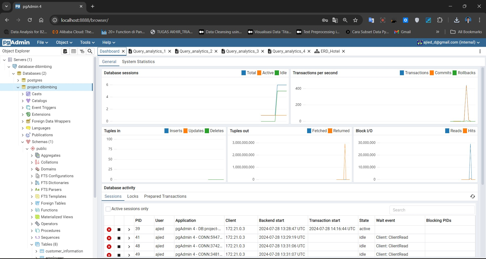
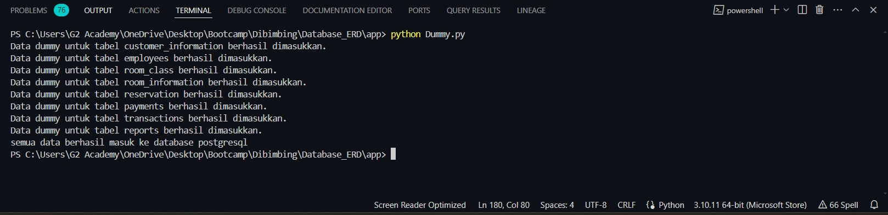
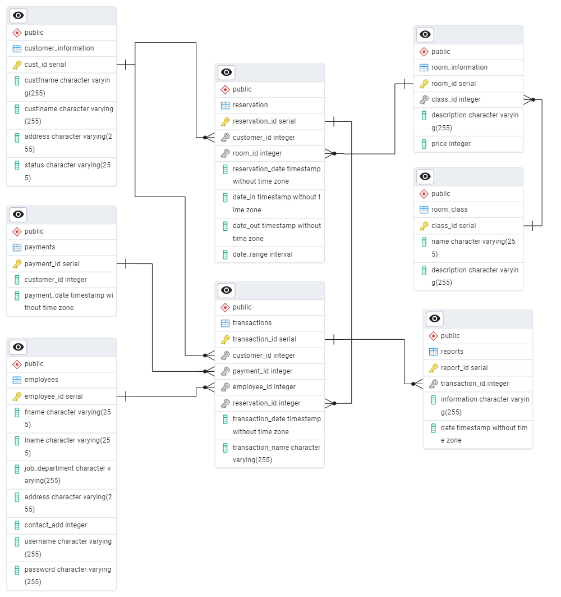

# Database Hotel dengan PostgreSQL @Dibimbing.id

## Deskripsi Proyek
Proyek ini bertujuan untuk memasukkan data dummy ke dalam database PostgreSQL yang akan digunakan untuk keperluan pengujian, simulasi, dan pengembangan aplikasi. Dengan menggunakan library Python seperti Faker dan psycopg2, data acak akan dihasilkan dan disimpan dalam berbagai tabel di database PostgreSQL.

## Prasyarat
Sebelum menjalankan proyek ini, pastikan Anda telah menginstal perangkat lunak berikut:

- Python : Digunakan untuk menjalankan skrip yang menghasilkan data dummy.

- PostgreSQL : Database yang digunakan untuk menyimpan data dummy.

- Docker Compose : Digunakan untuk menjalankan PostgreSQL dan pgAdmin sebagai layanan, memudahkan pengaturan lingkungan database.

## Langkah-langkah:

1. Menjalankan PostgreSQL dan pgAdmin Menggunakan Docker
Anda perlu membuat file docker-compose.yml yang mengonfigurasi PostgreSQL dan pgAdmin sebagai layanan. File ini akan mengatur database dan alat manajemen database berbasis web (pgAdmin). Setelah file docker-compose.yml disiapkan, Anda bisa menjalankan perintah:

docker-compose up -d
Perintah ini akan menjalankan PostgreSQL di port 5432 dan pgAdmin di http://localhost:8888.

Pgadmin4

2. Memverifikasi Koneksi ke Database PostgreSQL
Untuk memastikan bahwa Anda dapat terhubung ke database PostgreSQL, Anda dapat menjalankan skrip Python sederhana yang memverifikasi koneksi. Skrip ini akan menghubungkan ke database dan menampilkan versi PostgreSQL yang sedang berjalan.

3. Memasukkan Data Dummy ke Database
Skrip Python yang disiapkan dalam proyek ini menggunakan Faker untuk menghasilkan data acak dan psycopg2 untuk berinteraksi dengan database PostgreSQL. Data dummy ini mencakup berbagai tabel seperti:

- customer_information: Menyimpan informasi pelanggan seperti nama dan alamat.

- payments: Menyimpan informasi pembayaran terkait pelanggan.

- employees: Menyimpan data karyawan termasuk departemen dan kontak.

- room_class: Menyimpan informasi tentang kelas kamar.

- room_information: Menyimpan data kamar yang tersedia di hotel.

- reservation: Menyimpan data reservasi kamar oleh pelanggan.

- transactions: Mencatat transaksi yang terjadi dalam hotel, seperti pemesanan kamar atau layanan tambahan.

- reports: Menyimpan laporan terkait transaksi.

Anda dapat menjalankan skrip ini untuk memasukkan sejumlah besar data dummy ke dalam tabel-tabel tersebut.

4. Menjalankan Skrip
Untuk menjalankan skrip ini:

Pastikan database PostgreSQL sudah berjalan.

- Jalankan skrip verifikasi untuk memastikan koneksi ke database berhasil.

- Jalankan skrip utama untuk memasukkan data dummy ke dalam tabel yang relevan.

Data berhasil masuk ke database

5. ERD Database Hotel

